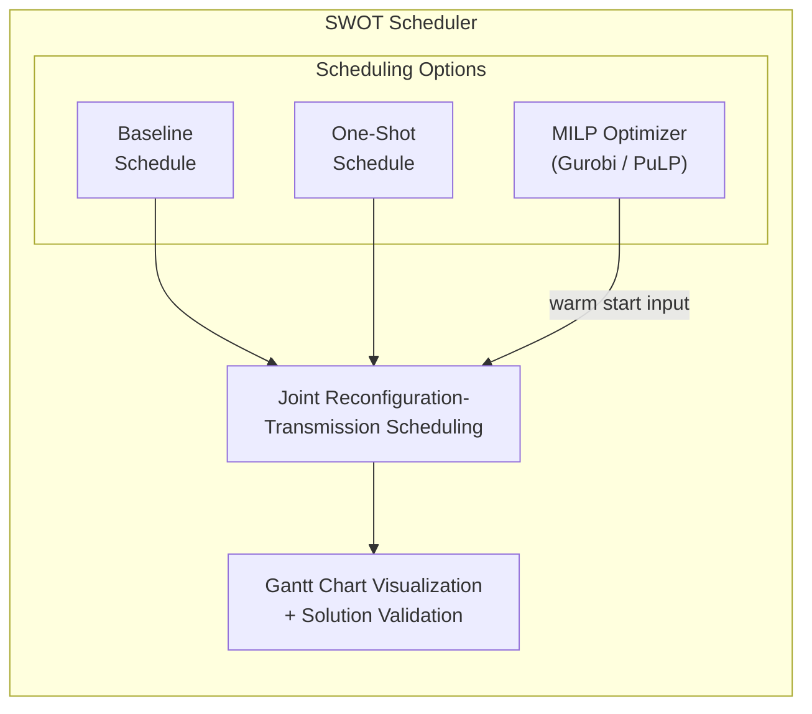

# SWOT: Enabling Reconfiguration-Communication Overlap for Collective Communication in Optical Networks

[](https://arxiv.org/abs/2510.19322)
[](LICENSE)
[](https://www.python.org/downloads/)

> **Official implementation** of the paper ["Enabling Reconfiguration-Communication Overlap for Collective Communication in Optical Networks"](https://arxiv.org/abs/2510.19322) .

[English](README.md) | [中文](README_ZH.md)

## 📖 Overview

SWOT (Scheduler for Workload-aligned Optical/Overlapping Topologies) is a framework that **overlaps optical circuit switch (OCS) reconfigurations with data transmissions** to minimize communication completion time (CCT) in distributed machine learning systems. Unlike traditional static pre-configured approaches, SWOT dynamically aligns network resources with collective communication traffic patterns through intra-collective reconfiguration.

### Key Features

- **🚀 25.0%-74.1% CCT Reduction**: Significant performance improvements over static baseline approaches
- **⚡ Reconfiguration-Communication Overlap**: Hides up to 53% reconfiguration overhead by overlapping with data transmission
- **🎯 MILP-Based Optimization**: Formulates joint scheduling as Mixed Integer Linear Programming for optimal solutions
- **🔧 Multi-Solver Support**: Works with commercial (Gurobi) and open-source (PuLP/COPT) solvers
- **📊 Comprehensive Evaluation**: Supports multiple collective algorithms for each primitive (AllReduce, AllToAll, AllGather, ReduceScatter)
- **🔬 Reproducible Research**: Complete experimental framework with automated parameter sweeps

### Supported Collective Algorithms

| Primitive | Algorithms |
|-----------|-----------|
| **AllReduce** | Ring, Halving-Doubling (Rabenseifner), Recursive-Doubling |
| **AllToAll** | Pairwise Exchange, Bruck's Algorithm |
| **AllGather** | Halving-Doubling |
| **ReduceScatter** | Halving-Doubling |

> SWOT supports most of the algorithms for each Collective Primitive, but in this codebase, we mainly implemented the typical algorithms mentioned above. If you need to extend it, you can add your own implementations in config/cc_algorithm.py.
>
> Note: for paper plotting in `scripts/simulation_fig.ipynb` / `scripts/simulation_fig.py`, we also include analytical AllReduce baselines such as `ar_dbt` and `ar_dbt_pipe`. These are comparison models computed in scripts, not scheduling algorithms registered in `config/cc_algorithm.py`.

## 🏗️ Architecture



## 🚀 Quick Start

### Prerequisites

- Python 3.10+
- Node.js/npm (optional, for development)
- Gurobi license (optional, for commercial solver)

### Installation

We recommend using [uv](https://github.com/astral-sh/uv) for dependency management:

```bash
# Install uv (macOS/Linux)
curl -LsSf https://astral.sh/uv/install.sh | sh

# Or via Homebrew
brew install uv

# Clone the repository
git clone https://github.com/yourusername/overlap4ocs.git
cd overlap4ocs

# Install dependencies
uv sync

# Optional: Install with Gurobi support
uv sync --extra gurobi

# Optional: Install with Jupyter notebook support
uv sync --extra notebook
```

<details>
<summary><b>Alternative: Using pip</b></summary>

```bash
pip install -r requirements.txt
```
</details>

### Running a Single Experiment

```bash
# Run with default configuration
uv run python main.py --config config/instance.toml

# Run with custom solver settings
uv run python main.py \
  --config config/instance.toml \
  --metrics-file logs/demo_metrics.json \
  --run-id demo-run
```

**Expected Output:**
- Gantt chart visualization: `figures/solution_*.pdf`
- Solution file: `solution/solution_*.json`
- Performance metrics in console

### Example Output

```
PuLP solver is available
Parameters loaded from config/instance.toml
...
Comparison:
One-shot CCT: 680 μs
Improvement over one-shot: 35%
Baseline CCT:  830 μs
Optimized CCT: 440 μs
Improvement over baseline: 47%
```

## 📊 Running Batch Experiments

For systematic parameter sweeps and reproducible research:

### 1. Generate Configuration Matrix

```bash
PYTHONPATH=. uv run python scripts/generate_matrix_configs.py \
  --matrix config/matrix/paper/exp2.2-matrix_sweep_msg+Tr.toml
```

This creates individual configuration files in `logs/generated_configs/<matrix_id>/`.

### 2. Execute Experiment Matrix

```bash
PYTHONPATH=. uv run python scripts/matrix_runner.py \
  --matrix config/matrix/paper/exp2.2-matrix_sweep_msg+Tr.toml
```

**Options:**
- `--limit N`: Run only N configurations
- `--rerun-failed`: Re-execute failed runs
- `--resume`: Skip already completed runs (default)
- `--extra-args "..."`: Pass additional arguments to main.py

**Output Structure:**
```
logs/runs/<timestamp>_<config_name>/
├── config/
│   ├── instance.toml
│   └── program.toml
├── figures/
│   ├── baseline_*.pdf
│   ├── oneshot_*.pdf
│   └── solution_*.pdf
├── solution/
│   ├── baseline_*.json
│   ├── oneshot_*.json
│   └── solution_*.json
├── metrics.json
├── metadata.json
└── run.log
```

### 3. Archive Experiments

```bash
uv run python scripts/matrix_archive.py \
  --matrix-id exp2.2-matrix_sweep_msg+Tr \
  --cleanup
```

## ⚙️ Configuration

### Instance Configuration (`config/instance.toml`)

```toml
# Solver configuration
solver = "pulp"              # Options: "gurobi", "pulp", "copt"
solver_gap = 0.05            # Relative MIP gap tolerance (5%)
solver_time_limit = 60       # Time limit in seconds

# Network topology
k = 4                        # Number of OCS switches
p = 256                      # Number of compute nodes
B = 12.5                     # Bandwidth per link (GBps)
T_reconf = 0.2               # OCS reconfiguration time (ms)
T_lat = 0.02                 # End-to-end base latency (ms)

# Workload
m = 32                       # Message size (MB)
algorithm = "ar_having-doubling"  # Collective algorithm
```

### Program Configuration (`config/program.toml`)

```toml
save_as_pdf = true           # Save Gantt charts as PDF
debug_mode = 0               # 0: off, 1: debug model, 2: comparison
show = false                 # Display charts interactively
```

### Supported Algorithms

| Algorithm ID | Description |
|--------------|-------------|
| `ar_ring` | AllReduce with Ring algorithm |
| `ar_having-doubling` | AllReduce with Rabenseifner's algorithm |
| `ar_recursive-doubling` | AllReduce with Recursive-Doubling |
| `a2a_pairwise` | AllToAll with Pairwise Exchange |
| `a2a_bruck` | AllToAll with Bruck's algorithm |
| `ag_having-doubling` | AllGather with Halving-Doubling |
| `rs_having-doubling` | ReduceScatter with Halving-Doubling |

## 📐 Mathematical Formulation

The SWOT scheduler formulates the joint optimization problem as a Mixed Integer Linear Program (MILP):

**Objective:** Minimize Communication Completion Time (CCT)

**Decision Variables:**
- `d[i,j]`: Data volume assigned to OCS j at step i
- `u[i,j]`: Binary indicator if OCS j is used at step i
- `r[i,j]`: Binary indicator if OCS j is reconfigured at step i
- `t_start[i,j]`, `t_end[i,j]`: Transmission start/end times
- `t_reconf_start[i,j]`, `t_reconf_end[i,j]`: Reconfiguration start/end times

**Key Constraints:**
1. **P1 (Transmission-Reconfiguration Precedence)**: Data transmission starts only after reconfiguration completes
2. **P2 (No Overlapping Activities)**: An OCS cannot perform two activities simultaneously
3. **P3 (Cross-Step Synchronization)**: Each step begins only after the previous step finishes

See [`math_model.md`](math_model.md) for detailed mathematical formulation.

## 📁 Repository Structure

```
overlap4ocs/
├── main.py                      # Main entry point
├── config/
│   ├── instance.toml           # Problem instance parameters
│   ├── program.toml            # Runtime configuration
│   ├── instance_parser.py      # Configuration parser
│   ├── cc_algorithm.py         # Collective algorithm definitions
│   └── matrix/
│       ├── paper/              # Matrix specs used by paper reproduction
│       └── examples/           # Extra sweep templates and historical examples
├── paradigm/
│   ├── model_gurobi.py         # Gurobi MILP formulation
│   ├── model_pulp.py           # PuLP MILP formulation
│   ├── solver_wrapper.py       # Unified solver interface
│   ├── baseline.py             # Baseline scheduling
│   ├── one_shot.py             # One-shot pre-configuration
│   ├── ideal.py                # Theoretical lower bound
│   └── warm_start.py           # Warm start initialization
├── scripts/
│   ├── generate_matrix_configs.py  # Generate experiment configs
│   ├── matrix_runner.py            # Execute batch experiments
│   ├── matrix_archive.py           # Archive experiment results
│   ├── prepare_simulation_data.py  # Build merged CSVs used by paper plotting
│   ├── simulation_fig.py           # Reproducible CLI figure generation (exp1.x/exp2.x)
│   └── simulation_fig.ipynb        # Full paper plotting notebook
├── utils/
│   ├── scheduler_analysis.py   # Result extraction & visualization
│   └── check_platform.py       # Platform detection
├── math_model.md               # Mathematical formulation
├── CLAUDE.md                   # Development guide
└── README.md                   # This file
```

## 🔬 Reproducing Paper Results

The paper figure pipeline depends on `scripts/simulation_fig.ipynb` plus matrix CSV outputs.
For direct reproducibility, use the scripted workflow below:

```bash
# 1) Run matrix experiments
for matrix in \
  config/matrix/paper/exp1.1-hd+bruck-1.toml \
  config/matrix/paper/exp1.1-pair-1.toml \
  config/matrix/paper/exp1.1-hd+bruck-2.toml \
  config/matrix/paper/exp1.1-pair-2.toml \
  config/matrix/paper/exp1.2-hd+bruck.toml \
  config/matrix/paper/exp1.2-pair.toml \
  config/matrix/paper/exp1.3-ar_rb.toml \
  config/matrix/paper/exp1.3-a2a_pair.toml \
  config/matrix/paper/exp1.3-a2a_bruck.toml \
  config/matrix/paper/exp2.1-matrix_sweep_msg+k-B.toml \
  config/matrix/paper/exp2.2-matrix_sweep_msg+Tr.toml; do
  PYTHONPATH=. uv run python scripts/matrix_runner.py --matrix "$matrix"
done

# 2) Build merged CSVs referenced by the notebook
uv run python scripts/prepare_simulation_data.py --target all

# 3a) Reproducible CLI plotting (exp1.1/1.2/1.3 + exp2.1/2.2)
uv run python scripts/simulation_fig.py --write-summary --output-dir figures/paper

# 3b) Interactive notebook plotting (full paper plots)
uv sync --extra notebook
jupyter notebook scripts/simulation_fig.ipynb
```

For full mapping from matrix configs to generated CSV files and figure entry points, see
[`docs/reproducibility.md`](docs/reproducibility.md).

## 📊 Visualization

SWOT generates Gantt charts showing:
- OCS reconfiguration periods (red bars)
- Data transmission periods (blue bars)
- Timeline for each OCS switch
- Step boundaries and synchronization points

Example output visualization:


*(Gantt chart showing optimized reconfiguration-transmission overlap)*

## 🛠️ Development

### Adding a New Collective Algorithm

1. Define algorithm parameters in `config/cc_algorithm.py`:

```python
def compute_my_algorithm_params(p: int, m: float) -> Dict[str, object]:
    return {
        'p': p_adjusted,
        'num_steps': num_steps,
        'm_i': {1: m/2, 2: m/2, ...},  # Message sizes per step
        'configurations': {1: 1, 2: 2, ...},  # OCS configs per step
    }
```

2. Register in `compute_algorithm_params()`:

```python
if algorithm == 'my_algorithm':
    return compute_my_algorithm_params(p, m)
```

### Running Tests

```bash
# Run a small test instance
uv run python main.py --config config/test_instance.toml

# Validate solution
uv run python -c "
from paradigm.solver_wrapper import load_and_validate_solution
from config.instance_parser import get_parameters
params = get_parameters('config/instance.toml')
load_and_validate_solution(params, 'solution/solution_*.json', solver='pulp')
"
```

## 📝 Citation

If you mention SWOT in your research, please cite our paper:

```bibtex
@article{wuEnablingReconfigurationCommunicationOverlap2025,
  title={Enabling Reconfiguration-Communication Overlap for Collective Communication in Optical Networks},
  author={Wu, Changbo and Yu, Zhuolong and Zhao, Gongming and Xu, Hongli},
  journal={arXiv preprint arXiv:2510.19322},
  year={2026}
}
```

## 📄 License

This project is licensed under the MIT License - see the [LICENSE](LICENSE) file for details.

## 🙏 Acknowledgments

- MILP solvers: [Gurobi Optimization](https://www.gurobi.com/), [COIN-OR PuLP](https://github.com/coin-or/pulp)

## 📧 Contact

For questions, issues, or collaboration inquiries:
- Open an issue on [GitHub Issues](https://github.com/ZER0-Nu1L/overlap4ocs/issues)
- Contact: [Email](wuchangbo@mail.ustc.edu.cn)

## 🗺️ Roadmap

- [ ] Packet-level simulator integration
- [ ] Integration with NCCL/MPI libraries
- [ ] Hardware testbed integration

---

**Note:** This is a research prototype.
