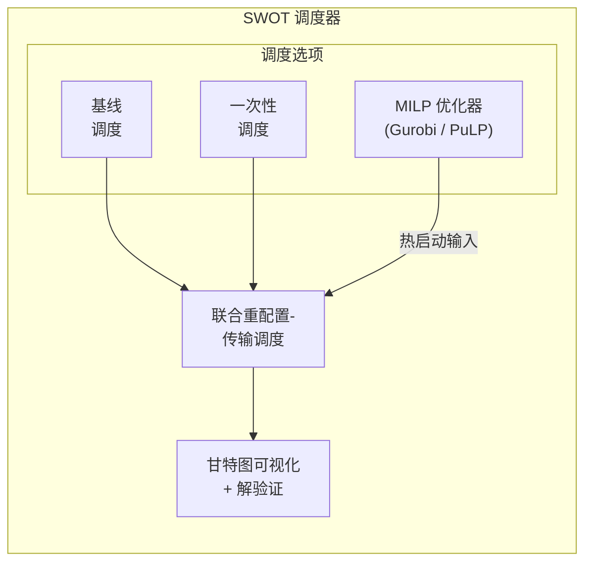
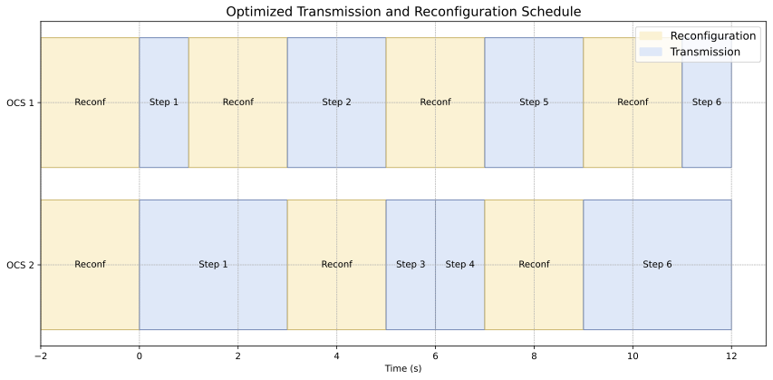

# SWOT：光网络集体通信的重配置-通信重叠调度

[](https://arxiv.org/abs/2510.19322)
[](LICENSE)
[](https://www.python.org/downloads/)

> 论文 ["Enabling Reconfiguration-Communication Overlap for Collective Communication in Optical Networks"](https://arxiv.org/abs/2510.19322) 的**官方实现**。

[English](README.md) | [中文](README_ZH.md)

## 📖 项目概述

SWOT（面向工作负载对齐的光/重叠拓扑调度器，Scheduler for Workload-aligned Optical/Overlapping Topologies）是一个通过**重叠光电路交换机（OCS）重配置与数据传输**来最小化分布式机器学习系统中通信完成时间（CCT）的框架。与传统的静态预配置方法不同，SWOT 通过集体内重配置动态地将网络资源与集体通信流量模式对齐。

### 核心特性

- **🚀 25.0%-74.1% CCT 降低**：相比静态基线方法实现显著性能提升
- **⚡ 重配置-通信重叠**：通过与数据传输重叠，隐藏高达 53% 的重配置开销
- **🎯 基于 MILP 的优化**：将联合调度问题建模为混合整数线性规划以获得最优解
- **🔧 多求解器支持**：支持商业求解器（Gurobi）和开源求解器（PuLP/COPT）
- **📊 全面评估**：支持每个集体原语的多种算法（AllReduce、AllToAll、AllGather、ReduceScatter）
- **🔬 可重现研究**：完整的实验框架，支持自动化参数扫描

### 支持的集体通信算法

| 原语 | 算法 |
|------|------|
| **AllReduce** | Ring、Halving-Doubling（Rabenseifner）、Recursive-Doubling |
| **AllToAll** | Pairwise Exchange、Bruck's 算法 |
| **AllGather** | Halving-Doubling |
| **ReduceScatter** | Halving-Doubling |

> SWOT 支持每个集体原语的大多数算法，但在此代码库中，我们主要实现了上述典型算法。如果您需要扩展，可以在 config/cc_algorithm.py 中添加自己的实现。
>
> 说明：在 `scripts/simulation_fig.ipynb` / `scripts/simulation_fig.py` 的论文绘图流程中，还会使用 `ar_dbt`、`ar_dbt_pipe` 等 AllReduce 解析基线。这些是脚本中用于对比的计算模型，不属于 `config/cc_algorithm.py` 中注册的调度算法实现。

## 🏗️ 系统架构



## 🚀 快速开始

### 环境要求

- Python 3.10+
- Node.js/npm（可选，用于开发）
- Gurobi 许可证（可选，用于商业求解器）

### 安装

我们推荐使用 [uv](https://github.com/astral-sh/uv) 进行依赖管理：

```bash
# 安装 uv（macOS/Linux）
curl -LsSf https://astral.sh/uv/install.sh | sh

# 或通过 Homebrew
brew install uv

# 克隆仓库
git clone https://github.com/yourusername/overlap4ocs.git
cd overlap4ocs

# 安装依赖
uv sync

# 可选：安装 Gurobi 支持
uv sync --extra gurobi

# 可选：安装 Jupyter notebook 支持
uv sync --extra notebook
```

<details>
<summary><b>替代方案：使用 pip</b></summary>

```bash
pip install -r requirements.txt
```
</details>

### 运行单个实验

```bash
# 使用默认配置运行
uv run python main.py --config config/instance.toml

# 使用自定义求解器设置运行
uv run python main.py \
  --config config/instance.toml \
  --metrics-file logs/demo_metrics.json \
  --run-id demo-run
```

**预期输出：**
- 甘特图可视化：`figures/solution_*.pdf`
- 解文件：`solution/solution_*.json`
- 控制台中的性能指标

### 输出示例

```
PuLP solver is available
Parameters loaded from config/instance.toml
...
Comparison:
One-shot CCT: 680 μs
Improvement over one-shot: 35%
Baseline CCT:  830 μs
Optimized CCT: 440 μs
Improvement over baseline: 47%
```

## 📊 运行批量实验

用于系统化参数扫描和可重现研究：

### 1. 生成配置矩阵

```bash
PYTHONPATH=. uv run python scripts/generate_matrix_configs.py \
  --matrix config/matrix/paper/example_matrix_sweep_msg+Tr.toml
```

这将在 `logs/generated_configs/<matrix_id>/` 中创建单独的配置文件。

### 2. 执行实验矩阵

```bash
PYTHONPATH=. uv run python scripts/matrix_runner.py \
  --matrix config/matrix/paper/example_matrix_sweep_msg+Tr.toml
```

**选项：**
- `--limit N`：仅运行 N 个配置
- `--rerun-failed`：重新执行失败的运行
- `--resume`：跳过已完成的运行（默认）
- `--extra-args "..."`：向 main.py 传递额外参数

**输出结构：**
```
logs/runs/<timestamp>_<config_name>/
├── config/
│   ├── instance.toml
│   └── program.toml
├── figures/
│   ├── baseline_*.pdf
│   ├── oneshot_*.pdf
│   └── solution_*.pdf
├── solution/
│   ├── baseline_*.json
│   ├── oneshot_*.json
│   └── solution_*.json
├── metrics.json
├── metadata.json
└── run.log
```

### 3. 归档实验

```bash
uv run python scripts/matrix_archive.py \
  --matrix-id example_matrix_sweep_msg+Tr \
  --cleanup
```

## ⚙️ 配置说明

### 实例配置（`config/instance.toml`）

```toml
# 求解器配置
solver = "pulp"              # 选项："gurobi"、"pulp"、"copt"
solver_gap = 0.05            # 相对 MIP 间隙容差（5%）
solver_time_limit = 60       # 时间限制（秒）

# 网络拓扑
k = 4                        # OCS 交换机数量
p = 256                      # 计算节点数量
B = 12.5                     # 每链路带宽（GBps）
T_reconf = 0.2               # OCS 重配置时间（ms）
T_lat = 0.02                 # 端到端基础延迟（ms）

# 工作负载
m = 32                       # 消息大小（MB）
algorithm = "ar_having-doubling"  # 集体通信算法
```

### 程序配置（`config/program.toml`）

```toml
save_as_pdf = true           # 将甘特图保存为 PDF
debug_mode = 0               # 0: 关闭，1: 调试模型，2: 比较模式
show = false                 # 交互式显示图表
```

### 支持的算法

| 算法 ID | 描述 |
|---------|------|
| `ar_ring` | 使用 Ring 算法的 AllReduce |
| `ar_having-doubling` | 使用 Rabenseifner 算法的 AllReduce |
| `ar_recursive-doubling` | 使用 Recursive-Doubling 的 AllReduce |
| `a2a_pairwise` | 使用 Pairwise Exchange 的 AllToAll |
| `a2a_bruck` | 使用 Bruck 算法的 AllToAll |
| `ag_having-doubling` | 使用 Halving-Doubling 的 AllGather |
| `rs_having-doubling` | 使用 Halving-Doubling 的 ReduceScatter |

## 📐 数学建模

SWOT 调度器将联合优化问题建模为混合整数线性规划（MILP）：

**目标：** 最小化通信完成时间（CCT）

**决策变量：**
- `d[i,j]`：第 i 步分配给 OCS j 的数据量
- `u[i,j]`：二进制指示变量，表示第 i 步是否使用 OCS j
- `r[i,j]`：二进制指示变量，表示第 i 步 OCS j 是否重配置
- `t_start[i,j]`、`t_end[i,j]`：传输开始/结束时间
- `t_reconf_start[i,j]`、`t_reconf_end[i,j]`：重配置开始/结束时间

**关键约束：**
1. **P1（传输-重配置优先级）**：数据传输仅在重配置完成后开始
2. **P2（无重叠活动）**：一个 OCS 不能同时执行两个活动
3. **P3（跨步骤同步）**：每个步骤仅在前一步骤完成后开始

详见 [`math_model.md`](math_model.md) 的详细数学建模。

## 📁 仓库结构

```
overlap4ocs/
├── main.py                      # 主入口
├── config/
│   ├── instance.toml           # 问题实例参数
│   ├── program.toml            # 运行时配置
│   ├── instance_parser.py      # 配置解析器
│   ├── cc_algorithm.py         # 集体通信算法定义
│   └── matrix/
│       ├── paper/              # 论文复现实验使用的矩阵配置
│       └── examples/           # 扩展扫描模板与历史示例
├── paradigm/
│   ├── model_gurobi.py         # Gurobi MILP 建模
│   ├── model_pulp.py           # PuLP MILP 建模
│   ├── solver_wrapper.py       # 统一求解器接口
│   ├── baseline.py             # 基线调度
│   ├── one_shot.py             # 一次性预配置
│   ├── ideal.py                # 理论下界
│   └── warm_start.py           # 热启动初始化
├── scripts/
│   ├── generate_matrix_configs.py  # 生成实验配置
│   ├── matrix_runner.py            # 执行批量实验
│   ├── matrix_archive.py           # 归档实验结果
│   ├── prepare_simulation_data.py  # 生成论文绘图所需的聚合 CSV
│   ├── simulation_fig.py           # 可复现 CLI 出图脚本（exp1.x/exp2.x）
│   └── simulation_fig.ipynb        # 论文完整绘图 notebook
├── utils/
│   ├── scheduler_analysis.py   # 结果提取与可视化
│   └── check_platform.py       # 平台检测
├── math_model.md               # 数学建模
├── CLAUDE.md                   # 开发指南
└── README.md                   # 英文说明文档
```

## 🔬 复现论文结果

论文绘图依赖 `scripts/simulation_fig.ipynb` 及矩阵实验 CSV。  
为避免手工拼接数据，建议按下面流程复现：

```bash
# 1) 执行矩阵实验
for matrix in \
  config/matrix/paper/exp1.1-hd+bruck-1.toml \
  config/matrix/paper/exp1.1-pair-1.toml \
  config/matrix/paper/exp1.1-hd+bruck-2.toml \
  config/matrix/paper/exp1.1-pair-2.toml \
  config/matrix/paper/exp1.2-hd+bruck.toml \
  config/matrix/paper/exp1.2-pair.toml \
  config/matrix/paper/exp1.3-ar_rb.toml \
  config/matrix/paper/exp1.3-a2a_pair.toml \
  config/matrix/paper/exp1.3-a2a_bruck.toml \
  config/matrix/paper/example_matrix_sweep_msg+k-B.toml \
  config/matrix/paper/example_matrix_sweep_msg+Tr.toml; do
  PYTHONPATH=. uv run python scripts/matrix_runner.py --matrix "$matrix"
done

# 2) 生成 notebook 依赖的聚合 CSV
uv run python scripts/prepare_simulation_data.py --target all

# 3a) 使用 CLI 直接出图（exp1.1/1.2/1.3 + exp2.1/2.2）
uv run python scripts/simulation_fig.py --write-summary --output-dir figures/paper

# 3b) 使用 notebook 交互分析（完整论文图）
uv sync --extra notebook
jupyter notebook scripts/simulation_fig.ipynb
```

配置文件与 CSV/图表入口映射见 [`docs/reproducibility.md`](docs/reproducibility.md)。

## 📊 可视化

SWOT 生成显示以下内容的甘特图：
- OCS 重配置周期（红色条）
- 数据传输周期（蓝色条）
- 每个 OCS 交换机的时间线
- 步骤边界和同步点

示例输出可视化：


*（显示优化重配置-传输重叠的甘特图）*

## 🛠️ 开发

### 添加新的集体通信算法

1. 在 `config/cc_algorithm.py` 中定义算法参数：

```python
def compute_my_algorithm_params(p: int, m: float) -> Dict[str, object]:
    return {
        'p': p_adjusted,
        'num_steps': num_steps,
        'm_i': {1: m/2, 2: m/2, ...},  # 每步消息大小
        'configurations': {1: 1, 2: 2, ...},  # 每步 OCS 配置
    }
```

2. 在 `compute_algorithm_params()` 中注册：

```python
if algorithm == 'my_algorithm':
    return compute_my_algorithm_params(p, m)
```

### 运行测试

```bash
# 运行小型测试实例
uv run python main.py --config config/test_instance.toml

# 验证解
uv run python -c "
from paradigm.solver_wrapper import load_and_validate_solution
from config.instance_parser import get_parameters
params = get_parameters('config/instance.toml')
load_and_validate_solution(params, 'solution/solution_*.json', solver='pulp')
"
```

## 📝 引用

如果您在研究中提到 SWOT，请引用我们的论文：

```bibtex
@article{wuEnablingReconfigurationCommunicationOverlap2025,
  title={Enabling Reconfiguration-Communication Overlap for Collective Communication in Optical Networks},
  author={Wu, Changbo and Yu, Zhuolong and Zhao, Gongming and Xu, Hongli},
  journal={arXiv preprint arXiv:2510.19322},
  year={2026}
}
```

## 📄 许可证

本项目采用 MIT 许可证 - 详见 [LICENSE](LICENSE) 文件。

## 🙏 致谢

- MILP 求解器：[Gurobi Optimization](https://www.gurobi.com/)、[COIN-OR PuLP](https://github.com/coin-or/pulp)

## 📧 联系方式

如有问题、反馈或合作咨询：
- 在 [GitHub Issues](https://github.com/ZER0-Nu1L/overlap4ocs/issues) 提交问题
- 联系：[Email](wuchangbo@mail.ustc.edu.cn)

## 🗺️ 开发路线图

- [ ] 包级模拟器集成
- [ ] 与 NCCL/MPI 库集成
- [ ] 硬件测试平台集成

---

**注意：** 这是一个研究原型。
